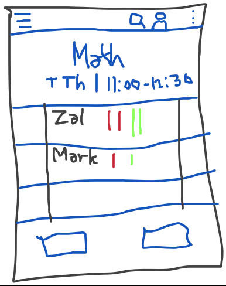
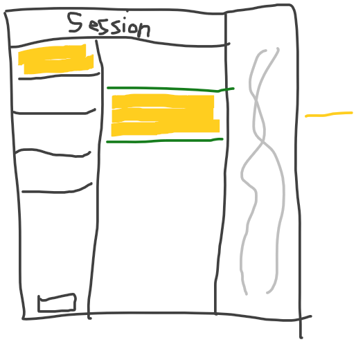
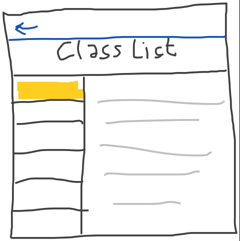
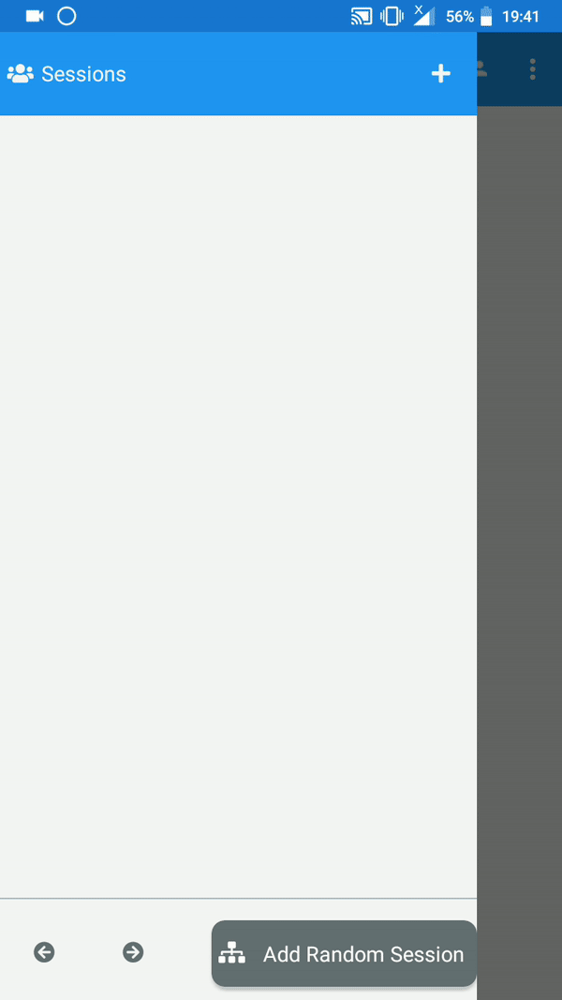

# Beadle App
>#### Class Beadle 
>- is a student assigned by the faculty or the College Dean **to assist mainly in recording faculty and student attendance** and in other class-related tasks.
*(https://www.hau.edu.ph/intranet/pdf/beadlehandbook2.pdf)* 

Beadle App is designed for Class Beadles to easily record the attendance of their class.

## Version 1 (Presented @ Feb. 12, 2019)

### Mockup
| Main Screen      | Master Detail Slider     | 2nd Screen     |
| ------------ | ------------- | ------------- |
|  |  |  |

